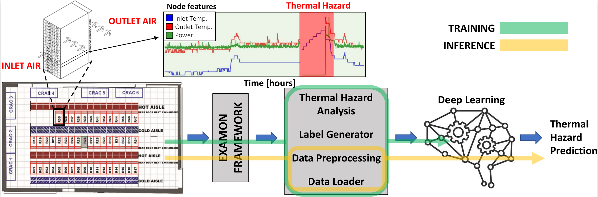
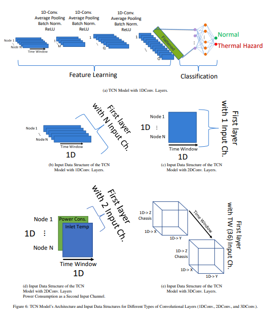

# HazardNet: A Thermal Hazard Prediction Framework for Datacenters
Welcome to the README file for the scripts related to the scientific paper on thermal hazard prediction in datacenters. 
The readme and some other parts of the scripts will be updated after publishing the manuscripts.

## Introduction
Modern scientific discoveries rely on an insatiable demand for computational resources. To meet this ever-growing computing demand, the datacenters have been established, which are complex controlled environments that host thousands of computing nodes, storage, high-performance communication networks, cooling systems, etc. A datacenter consumes a large amount of electrical power (in the range of megawatts), which gets completely transformed into heat, creating complex spatial and temporal thermal dissipation problems. Therefore, although a datacenter contains sophisticated cooling systems, minor thermal issues/anomalies can potentially trigger a chain of events that leads to an imbalance between the heat generated by computing nodes and the heat removed by the cooling system, leading to thermal hazards. Thermal hazards are detrimental to datacenter operations as they can lead to IT and facility equipment damage as well as an outage of the datacenter, with severe societal and business losses. So, predicting the thermal hazard/anomaly is critical to prevent future disasters. In doing so, collecting and analyzing large-scale monitoring signals and methodology for anomaly detection and prediction are challenging tasks.
In this manuscript (link of the paper), after providing a methodology for defining the thermal anomaly, we proposed HazardNet, a thermal hazard prediction framework that consists of a complete pipeline of deep learning models.
## Dataset
The dataset for this study is available in the following link: https://doi.org/10.5281/zenodo.10050368
This dataset entry showcases a comprehensive collection obtained from the Tier-0 supercomputer, Marconi A2, hosted at CINECA (https://www.hpc.cineca.it/). The dataset records inlet and outlet temperatures along with power consumption data from 3312 computing nodes, spanning from January 14, 2019, to December 31, 2019. The data is generated through ExaMon, a sophisticated monitoring datacenter infrastructure. The primary objective of this dataset is to support the research and development of HazardNet, an innovative thermal hazard prediction framework tailored specifically for datacenters. 
## HazardNet Framework
Thermal Hazard Prediction Framework we propose a framework for predicting thermal hazard, which encompasses data query and preprocessing, model training, and final model inference, which provides the prediction. The thermal hazard predictor is a model that, using time series data of compute nodes’ sensors, predicts if a thermal hazard will happen in the datacenter within the next hours. The input data are the time series of nodes’ temperature (and power consumption), and the output is a binary classification: likely forthcoming hazard or not. Prediction Horizon = 6 hours was chosen after consulting with the facility manager. 

Following figure illustrates the architecture of our proposed thermal hazard predictor, which is composed of three main components: the data collection, and storage architecture based on datacenter monitoring system, the thermal hazard analysis including the data extraction, preprocessing (e.g., missed data handling, time alignments), label generator and data loader, and the Artificial Intelligence (AI)-powered thermal hazard prediction system (training and inference). Different classical ML and DL tools are candidates for operation as the Al model. The AI model’s input is a Time Window of data extracted from the database. In the off-line training stage, a large set of Time Windows is extracted (training dataset), and preprocessed to generate the ground-truth labels with the rule-based statistical approach. Inferences with the trained model are the predictions of thermal hazards.

## TCN Model’s Architecture and Input Data Structures
TCN Model’s Architecture and Input Data Structures for Different Types of Convolutional Layers (1DConv., 2DConv., and 3DConv.).
