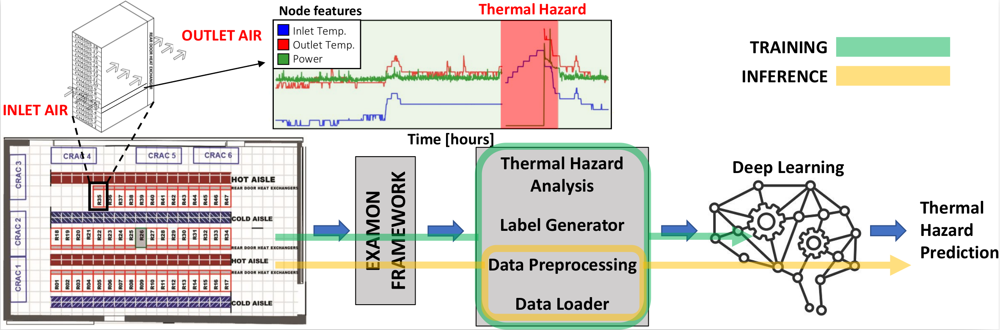
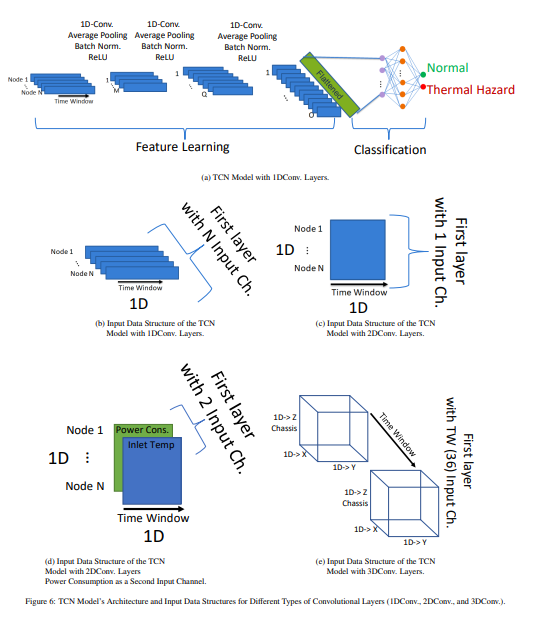

# HazardNet: A Thermal Hazard Prediction Framework for Datacenters

HazardNet is an open-source deep learning framework for **thermal hazard (thermal anomaly) prediction in HPC datacenters and supercomputers**. It uses time-series data from compute-node temperature and power sensors to predict whether a thermal hazard is likely within the next few hours, framed as a binary classification problem.

[](./LICENSE)


> Note: The README and some parts of the scripts will be updated after the associated manuscript is published.

## What is this?

HazardNet is a research codebase that implements a complete pipeline for predicting thermal hazards in datacenters using deep learning on sensor time series. It includes data loading and preprocessing helpers, several model architectures (Temporal Convolutional Networks, LSTM, and SVM baselines), and training scripts.

- **Who is it for:** HPC operators, datacenter facility engineers, and machine-learning researchers working on datacenter thermal management, anomaly detection, and predictive maintenance.
- **What problem it solves:** Minor thermal anomalies in a datacenter can escalate into thermal hazards that damage equipment and cause outages. HazardNet predicts forthcoming thermal hazards ahead of time so operators can act before failures occur.
- **How it works:** Given a time window of compute-node inlet/outlet temperature (and power) readings, a trained model outputs a binary prediction — likely forthcoming thermal hazard, or not — over a chosen prediction horizon.

## Table of contents

- [Introduction](#introduction)
- [Dataset](#dataset)
- [HazardNet Framework](#hazardnet-framework)
- [TCN Model's Architecture and Input Data Structures](#tcn-models-architecture-and-input-data-structures)
- [Models](#models)
- [Repository structure](#repository-structure)
- [Requirements](#requirements)
- [How to run](#how-to-run)
- [Limitations and status](#limitations-and-status)
- [Citation](#citation)
- [License](#license)

## Introduction

Modern scientific discoveries rely on an insatiable demand for computational resources. To meet this ever-growing computing demand, the datacenters have been established, which are complex controlled environments that host thousands of computing nodes, storage, high-performance communication networks, cooling systems, etc. A datacenter consumes a large amount of electrical power (in the range of megawatts), which gets completely transformed into heat, creating complex spatial and temporal thermal dissipation problems. Therefore, although a datacenter contains sophisticated cooling systems, minor thermal issues/anomalies can potentially trigger a chain of events that leads to an imbalance between the heat generated by computing nodes and the heat removed by the cooling system, leading to thermal hazards. Thermal hazards are detrimental to datacenter operations as they can lead to IT and facility equipment damage as well as an outage of the datacenter, with severe societal and business losses. So, predicting the thermal hazard/anomaly is critical to prevent future disasters. In doing so, collecting and analyzing large-scale monitoring signals and methodology for anomaly detection and prediction are challenging tasks.

In this manuscript (link of the paper), after providing a methodology for defining the thermal anomaly, we proposed HazardNet, a thermal hazard prediction framework that consists of a complete pipeline of deep learning models.

## Dataset

The dataset for this study is available at the following link: https://doi.org/10.5281/zenodo.10050368

This dataset entry showcases a comprehensive collection obtained from the Tier-0 supercomputer, Marconi A2, hosted at CINECA (https://www.hpc.cineca.it/). The dataset records inlet and outlet temperatures along with power consumption data from 3312 computing nodes, spanning from January 14, 2019, to December 31, 2019. The data is generated through ExaMon, a sophisticated monitoring datacenter infrastructure. The primary objective of this dataset is to support the research and development of HazardNet, an innovative thermal hazard prediction framework tailored specifically for datacenters.

## HazardNet Framework

Thermal Hazard Prediction Framework: we propose a framework for predicting thermal hazard, which encompasses data query and preprocessing, model training, and final model inference, which provides the prediction. The thermal hazard predictor is a model that, using time series data of compute nodes' sensors, predicts if a thermal hazard will happen in the datacenter within the next hours. The input data are the time series of nodes' temperature (and power consumption), and the output is a binary classification: likely forthcoming hazard or not. Prediction Horizon = 6 hours was chosen after consulting with the facility manager.

The following figure illustrates the architecture of our proposed thermal hazard predictor, which is composed of three main components: the data collection and storage architecture based on the datacenter monitoring system; the thermal hazard analysis, including data extraction, preprocessing (e.g., missed data handling, time alignments), label generator, and data loader; and the Artificial Intelligence (AI)-powered thermal hazard prediction system (training and inference). Different classical ML and DL tools are candidates for operation as the AI model. The AI model's input is a Time Window of data extracted from the database. In the off-line training stage, a large set of Time Windows is extracted (training dataset) and preprocessed to generate the ground-truth labels with the rule-based statistical approach. Inferences with the trained model are the predictions of thermal hazards.



## TCN Model's Architecture and Input Data Structures

TCN Model's Architecture and Input Data Structures for Different Types of Convolutional Layers (1DConv., 2DConv., and 3DConv.).



## Models

HazardNet implements and compares several time-series models for thermal hazard prediction:

| Model | Variants | Framework |
|-------|----------|-----------|
| Temporal Convolutional Network (TCN) | 1D, 2D, and 3D convolutional input structures | PyTorch |
| LSTM (recurrent) | Time-separated sequences | TensorFlow / Keras |
| SVM (baseline) | RBF / linear kernels | scikit-learn |

Models consume a sliding time window (36 time steps in the provided scripts) of node sensor readings and produce a binary hazard/no-hazard prediction. Training utilities compute confusion-matrix-based metrics (precision, recall, F1) for evaluation.

## Repository structure

```
HazardNet/
├── Train_TCN_1D3312C_TS.py   # Train TCN with 1D convolution input
├── Train_TCN_2D1C_TS.py      # Train TCN with 2D convolution input
├── Train_TCN_3D36C_TS.py     # Train TCN with 3D convolution input
├── Train_LSTM_TS.py          # Train LSTM model (TensorFlow/Keras)
├── Train_SVM_TS.py           # Train SVM baseline (scikit-learn)
├── src/
│   ├── HazardNet_DL_Helpers.py  # Datasets, dataloaders, training/validation loops, metrics
│   └── HazardNet_Utils.py       # Filesystem, logging, plotting, and results utilities
├── framework.png             # Framework architecture figure
├── paper_arch.png            # TCN model architecture figure
└── LICENSE                   # Apache-2.0
```

## Requirements

The scripts use Python 3 with, depending on the model:

- PyTorch and `torchsummary` (TCN models)
- TensorFlow / Keras (LSTM model)
- scikit-learn (SVM baseline)
- NumPy, pandas, matplotlib

## How to run

1. Download the dataset from Zenodo (https://doi.org/10.5281/zenodo.10050368).
2. Ensure the data-generation/model modules referenced by the training scripts are available on the Python path (`./src/`).
3. Run a training script for the model of interest, for example:

   ```bash
   python Train_TCN_1D3312C_TS.py
   ```

   or

   ```bash
   python Train_LSTM_TS.py
   ```

Training results, logs, and plots are written to a `TRAIN_RESULTS/` directory created at runtime.

## Limitations and status

- This is a **research codebase** accompanying a scientific manuscript, not a packaged, production-ready library.
- The training scripts expect data-generation and model-definition modules (e.g., `HazardNet_DataGen`, `HazardNet_Models`) that are referenced from `./src/`; make sure they are present before running.
- Models and preprocessing were developed for the Marconi A2 / CINECA dataset; applying them to other datacenters will require adapting the data loaders and labels.
- The README and parts of the scripts will be updated after the manuscript is published.

## Citation

If you use HazardNet or the associated dataset in your research, please cite the dataset and this repository. See [`CITATION.cff`](./CITATION.cff) for machine-readable metadata.

Dataset (inlet/outlet temperature and power consumption from the Marconi A2 supercomputer at CINECA, via ExaMon):

```
HazardNet dataset. Zenodo. https://doi.org/10.5281/zenodo.10050368
```

## License

This project is licensed under the **Apache License 2.0**. See the [LICENSE](./LICENSE) file for details.
